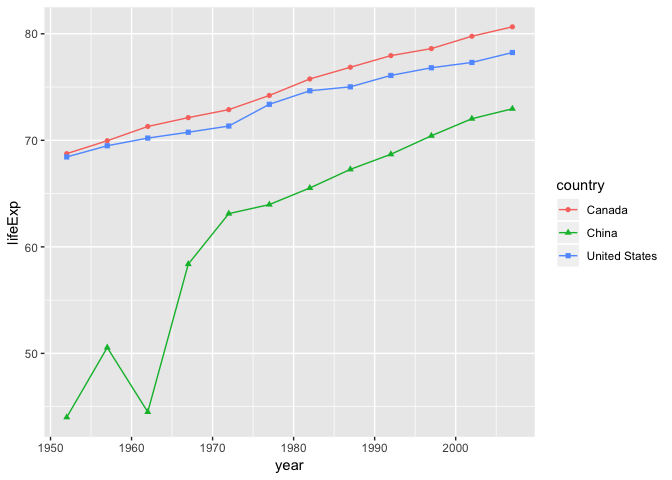

hw04 Tidy data and joins
================

``` r
suppressPackageStartupMessages(library(tidyverse))
suppressPackageStartupMessages(library(gapminder))
```

``` r
library(tidyverse)
library(knitr)
library(gapminder)
```

Data Reshaping Prompts (and relationship to aggregation)
--------------------------------------------------------

#### Activity \# 2

Make a tibble with one row per year and columns for life expectancy for two or more countries. Use knitr::kable() to make this table look pretty in your rendered homework. Take advantage of this new data shape to scatterplot life expectancy for one country against that of another.

For this task, I will take the life expectancy of Canada, China, and United States. In order to create the desired table for task, we need reshape the tibble to put each of the country into a column. This can be accomplished by the `spread()` function, which will make the chosen keys (country) into columns and put the values (life expectancy) into the rows.

``` r
spreadLifeExp <- gapminder %>% # save this dataframe to spreadLifeExp
  filter(country == "Canada" | country == "China" | country == "United States") %>% # select three countries
  select(country, year, lifeExp) %>% 
  spread(key=country, value=lifeExp) 

spreadLifeExp %>% 
    knitr::kable()
```

|  year|  Canada|     China|  United States|
|-----:|-------:|---------:|--------------:|
|  1952|  68.750|  44.00000|         68.440|
|  1957|  69.960|  50.54896|         69.490|
|  1962|  71.300|  44.50136|         70.210|
|  1967|  72.130|  58.38112|         70.760|
|  1972|  72.880|  63.11888|         71.340|
|  1977|  74.210|  63.96736|         73.380|
|  1982|  75.760|  65.52500|         74.650|
|  1987|  76.860|  67.27400|         75.020|
|  1992|  77.950|  68.69000|         76.090|
|  1997|  78.610|  70.42600|         76.810|
|  2002|  79.770|  72.02800|         77.310|
|  2007|  80.653|  72.96100|         78.242|

Then, we can plot the life expentacy for `China vs Canada`, `China vs United States`, and `Canada vs United States`.

``` r
spreadLifeExp %>% 
  ggplot(aes(x = China, y = Canada)) + 
  geom_point()
```


``` r
spreadLifeExp %>% 
ggplot(aes(x = China, y = `United States`)) + 
    geom_point()
```


``` r
spreadLifeExp %>% 
ggplot(aes(x = Canada, y = `United States`)) + 
    geom_point()
```


For a better comparision between three countries, we can plot the life expectancy changing over the year.

``` r
spreadLifeExp %>% 
  gather(country, lifeExp, 2:4) %>%  # gather the lifeExp from column 2 to 4
  ggplot(aes(year, lifeExp, color = country)) +
  geom_line() + 
  geom_point(aes(shape = country))
```



As we can see from the above plot, the life expectancy changed rapidly for China over the past few decades. US and Canada have very steady increasing trend.

Join Prompts (join, merge, look up)
-----------------------------------

#### Activity \# 1

Create a second data frame, complementary to Gapminder. Join this with (part of) Gapminder using a dplyr join function and make some observations about the process and result. Explore the different types of joins. Examples of a second data frame you could build: One row per country, a country variable and one or more variables with extra info, such as language spoken, NATO membership, national animal, or capitol city. One row per continent, a continent variable and one or more variables with extra info, such as northern versus southern hemisphere.

For this task, I have tested 4 join functions (`left_join`, `right_join`, `inner_join`, `full_join`). I created another dataframe `national_animal` with three columns `country`, `capital`, `animal` (national animal) for four countries (`China`, `India`, `Japan`, and `Singapore`). In order to better understand the function of these join methods (and also keep the document clean and concise), I fetch some Asian countries data (instead of all countries or all asian countries, which may have way more information than I actually need and want to show) from `gapminder` which include both the countries I selected above and also some other countries (`Indonesia` and `Thailand`). More importantly, I removed the `Singapore` from this dataframe. I save this dataframe to `asianCountries`.

``` r
# create national_animal dataframe
national_animal <-  data.frame(
  country = c("China", "India", "Japan","Singapore"),
  capital = c("Beijing", "New Delhi", "Tokyo", "Singapore"),
  animal = c("Panda", "Bengal tiger", "Green pheasant", "Lion")
)
national_animal %>% 
    knitr::kable()
```

| country   | capital   | animal         |
|:----------|:----------|:---------------|
| China     | Beijing   | Panda          |
| India     | New Delhi | Bengal tiger   |
| Japan     | Tokyo     | Green pheasant |
| Singapore | Singapore | Lion           |

``` r
# only grap some countries for comparison
asianCountries <- gapminder %>%
  filter(country %in% c("China", "India", "Japan", "Indonesia", "Thailand"))
 
asianCountries %>%  
knitr::kable()
```

| country   | continent |  year|   lifeExp|         pop|   gdpPercap|
|:----------|:----------|-----:|---------:|-----------:|-----------:|
| China     | Asia      |  1952|  44.00000|   556263527|    400.4486|
| China     | Asia      |  1957|  50.54896|   637408000|    575.9870|
| China     | Asia      |  1962|  44.50136|   665770000|    487.6740|
| China     | Asia      |  1967|  58.38112|   754550000|    612.7057|
| China     | Asia      |  1972|  63.11888|   862030000|    676.9001|
| China     | Asia      |  1977|  63.96736|   943455000|    741.2375|
| China     | Asia      |  1982|  65.52500|  1000281000|    962.4214|
| China     | Asia      |  1987|  67.27400|  1084035000|   1378.9040|
| China     | Asia      |  1992|  68.69000|  1164970000|   1655.7842|
| China     | Asia      |  1997|  70.42600|  1230075000|   2289.2341|
| China     | Asia      |  2002|  72.02800|  1280400000|   3119.2809|
| China     | Asia      |  2007|  72.96100|  1318683096|   4959.1149|
| India     | Asia      |  1952|  37.37300|   372000000|    546.5657|
| India     | Asia      |  1957|  40.24900|   409000000|    590.0620|
| India     | Asia      |  1962|  43.60500|   454000000|    658.3472|
| India     | Asia      |  1967|  47.19300|   506000000|    700.7706|
| India     | Asia      |  1972|  50.65100|   567000000|    724.0325|
| India     | Asia      |  1977|  54.20800|   634000000|    813.3373|
| India     | Asia      |  1982|  56.59600|   708000000|    855.7235|
| India     | Asia      |  1987|  58.55300|   788000000|    976.5127|
| India     | Asia      |  1992|  60.22300|   872000000|   1164.4068|
| India     | Asia      |  1997|  61.76500|   959000000|   1458.8174|
| India     | Asia      |  2002|  62.87900|  1034172547|   1746.7695|
| India     | Asia      |  2007|  64.69800|  1110396331|   2452.2104|
| Indonesia | Asia      |  1952|  37.46800|    82052000|    749.6817|
| Indonesia | Asia      |  1957|  39.91800|    90124000|    858.9003|
| Indonesia | Asia      |  1962|  42.51800|    99028000|    849.2898|
| Indonesia | Asia      |  1967|  45.96400|   109343000|    762.4318|
| Indonesia | Asia      |  1972|  49.20300|   121282000|   1111.1079|
| Indonesia | Asia      |  1977|  52.70200|   136725000|   1382.7021|
| Indonesia | Asia      |  1982|  56.15900|   153343000|   1516.8730|
| Indonesia | Asia      |  1987|  60.13700|   169276000|   1748.3570|
| Indonesia | Asia      |  1992|  62.68100|   184816000|   2383.1409|
| Indonesia | Asia      |  1997|  66.04100|   199278000|   3119.3356|
| Indonesia | Asia      |  2002|  68.58800|   211060000|   2873.9129|
| Indonesia | Asia      |  2007|  70.65000|   223547000|   3540.6516|
| Japan     | Asia      |  1952|  63.03000|    86459025|   3216.9563|
| Japan     | Asia      |  1957|  65.50000|    91563009|   4317.6944|
| Japan     | Asia      |  1962|  68.73000|    95831757|   6576.6495|
| Japan     | Asia      |  1967|  71.43000|   100825279|   9847.7886|
| Japan     | Asia      |  1972|  73.42000|   107188273|  14778.7864|
| Japan     | Asia      |  1977|  75.38000|   113872473|  16610.3770|
| Japan     | Asia      |  1982|  77.11000|   118454974|  19384.1057|
| Japan     | Asia      |  1987|  78.67000|   122091325|  22375.9419|
| Japan     | Asia      |  1992|  79.36000|   124329269|  26824.8951|
| Japan     | Asia      |  1997|  80.69000|   125956499|  28816.5850|
| Japan     | Asia      |  2002|  82.00000|   127065841|  28604.5919|
| Japan     | Asia      |  2007|  82.60300|   127467972|  31656.0681|
| Thailand  | Asia      |  1952|  50.84800|    21289402|    757.7974|
| Thailand  | Asia      |  1957|  53.63000|    25041917|    793.5774|
| Thailand  | Asia      |  1962|  56.06100|    29263397|   1002.1992|
| Thailand  | Asia      |  1967|  58.28500|    34024249|   1295.4607|
| Thailand  | Asia      |  1972|  60.40500|    39276153|   1524.3589|
| Thailand  | Asia      |  1977|  62.49400|    44148285|   1961.2246|
| Thailand  | Asia      |  1982|  64.59700|    48827160|   2393.2198|
| Thailand  | Asia      |  1987|  66.08400|    52910342|   2982.6538|
| Thailand  | Asia      |  1992|  67.29800|    56667095|   4616.8965|
| Thailand  | Asia      |  1997|  67.52100|    60216677|   5852.6255|
| Thailand  | Asia      |  2002|  68.56400|    62806748|   5913.1875|
| Thailand  | Asia      |  2007|  70.61600|    65068149|   7458.3963|

### `left_join`

First, let's discuss the `left_join` function. For example, `left_join(a_tibble, b_tibble, by = c("id_col1"))`, will takes all values from `a_tibble`, and looks for matches in the second table `b_tibble`. If it finds a match, it adds the data from the second table. If not, it adds missing values `NA`. We can do `left_join` the `national_animal` data frame to the `asianCountries` dataframe. We can see that `Indonesia` and `Thailand` doesn't have values for the `capital` and `animal` columns.

``` r
left_join(asianCountries, national_animal, by="country") %>% 
   knitr::kable()
```

    ## Warning: Column `country` joining factors with different levels, coercing
    ## to character vector

| country   | continent |  year|   lifeExp|         pop|   gdpPercap| capital   | animal         |
|:----------|:----------|-----:|---------:|-----------:|-----------:|:----------|:---------------|
| China     | Asia      |  1952|  44.00000|   556263527|    400.4486| Beijing   | Panda          |
| China     | Asia      |  1957|  50.54896|   637408000|    575.9870| Beijing   | Panda          |
| China     | Asia      |  1962|  44.50136|   665770000|    487.6740| Beijing   | Panda          |
| China     | Asia      |  1967|  58.38112|   754550000|    612.7057| Beijing   | Panda          |
| China     | Asia      |  1972|  63.11888|   862030000|    676.9001| Beijing   | Panda          |
| China     | Asia      |  1977|  63.96736|   943455000|    741.2375| Beijing   | Panda          |
| China     | Asia      |  1982|  65.52500|  1000281000|    962.4214| Beijing   | Panda          |
| China     | Asia      |  1987|  67.27400|  1084035000|   1378.9040| Beijing   | Panda          |
| China     | Asia      |  1992|  68.69000|  1164970000|   1655.7842| Beijing   | Panda          |
| China     | Asia      |  1997|  70.42600|  1230075000|   2289.2341| Beijing   | Panda          |
| China     | Asia      |  2002|  72.02800|  1280400000|   3119.2809| Beijing   | Panda          |
| China     | Asia      |  2007|  72.96100|  1318683096|   4959.1149| Beijing   | Panda          |
| India     | Asia      |  1952|  37.37300|   372000000|    546.5657| New Delhi | Bengal tiger   |
| India     | Asia      |  1957|  40.24900|   409000000|    590.0620| New Delhi | Bengal tiger   |
| India     | Asia      |  1962|  43.60500|   454000000|    658.3472| New Delhi | Bengal tiger   |
| India     | Asia      |  1967|  47.19300|   506000000|    700.7706| New Delhi | Bengal tiger   |
| India     | Asia      |  1972|  50.65100|   567000000|    724.0325| New Delhi | Bengal tiger   |
| India     | Asia      |  1977|  54.20800|   634000000|    813.3373| New Delhi | Bengal tiger   |
| India     | Asia      |  1982|  56.59600|   708000000|    855.7235| New Delhi | Bengal tiger   |
| India     | Asia      |  1987|  58.55300|   788000000|    976.5127| New Delhi | Bengal tiger   |
| India     | Asia      |  1992|  60.22300|   872000000|   1164.4068| New Delhi | Bengal tiger   |
| India     | Asia      |  1997|  61.76500|   959000000|   1458.8174| New Delhi | Bengal tiger   |
| India     | Asia      |  2002|  62.87900|  1034172547|   1746.7695| New Delhi | Bengal tiger   |
| India     | Asia      |  2007|  64.69800|  1110396331|   2452.2104| New Delhi | Bengal tiger   |
| Indonesia | Asia      |  1952|  37.46800|    82052000|    749.6817| NA        | NA             |
| Indonesia | Asia      |  1957|  39.91800|    90124000|    858.9003| NA        | NA             |
| Indonesia | Asia      |  1962|  42.51800|    99028000|    849.2898| NA        | NA             |
| Indonesia | Asia      |  1967|  45.96400|   109343000|    762.4318| NA        | NA             |
| Indonesia | Asia      |  1972|  49.20300|   121282000|   1111.1079| NA        | NA             |
| Indonesia | Asia      |  1977|  52.70200|   136725000|   1382.7021| NA        | NA             |
| Indonesia | Asia      |  1982|  56.15900|   153343000|   1516.8730| NA        | NA             |
| Indonesia | Asia      |  1987|  60.13700|   169276000|   1748.3570| NA        | NA             |
| Indonesia | Asia      |  1992|  62.68100|   184816000|   2383.1409| NA        | NA             |
| Indonesia | Asia      |  1997|  66.04100|   199278000|   3119.3356| NA        | NA             |
| Indonesia | Asia      |  2002|  68.58800|   211060000|   2873.9129| NA        | NA             |
| Indonesia | Asia      |  2007|  70.65000|   223547000|   3540.6516| NA        | NA             |
| Japan     | Asia      |  1952|  63.03000|    86459025|   3216.9563| Tokyo     | Green pheasant |
| Japan     | Asia      |  1957|  65.50000|    91563009|   4317.6944| Tokyo     | Green pheasant |
| Japan     | Asia      |  1962|  68.73000|    95831757|   6576.6495| Tokyo     | Green pheasant |
| Japan     | Asia      |  1967|  71.43000|   100825279|   9847.7886| Tokyo     | Green pheasant |
| Japan     | Asia      |  1972|  73.42000|   107188273|  14778.7864| Tokyo     | Green pheasant |
| Japan     | Asia      |  1977|  75.38000|   113872473|  16610.3770| Tokyo     | Green pheasant |
| Japan     | Asia      |  1982|  77.11000|   118454974|  19384.1057| Tokyo     | Green pheasant |
| Japan     | Asia      |  1987|  78.67000|   122091325|  22375.9419| Tokyo     | Green pheasant |
| Japan     | Asia      |  1992|  79.36000|   124329269|  26824.8951| Tokyo     | Green pheasant |
| Japan     | Asia      |  1997|  80.69000|   125956499|  28816.5850| Tokyo     | Green pheasant |
| Japan     | Asia      |  2002|  82.00000|   127065841|  28604.5919| Tokyo     | Green pheasant |
| Japan     | Asia      |  2007|  82.60300|   127467972|  31656.0681| Tokyo     | Green pheasant |
| Thailand  | Asia      |  1952|  50.84800|    21289402|    757.7974| NA        | NA             |
| Thailand  | Asia      |  1957|  53.63000|    25041917|    793.5774| NA        | NA             |
| Thailand  | Asia      |  1962|  56.06100|    29263397|   1002.1992| NA        | NA             |
| Thailand  | Asia      |  1967|  58.28500|    34024249|   1295.4607| NA        | NA             |
| Thailand  | Asia      |  1972|  60.40500|    39276153|   1524.3589| NA        | NA             |
| Thailand  | Asia      |  1977|  62.49400|    44148285|   1961.2246| NA        | NA             |
| Thailand  | Asia      |  1982|  64.59700|    48827160|   2393.2198| NA        | NA             |
| Thailand  | Asia      |  1987|  66.08400|    52910342|   2982.6538| NA        | NA             |
| Thailand  | Asia      |  1992|  67.29800|    56667095|   4616.8965| NA        | NA             |
| Thailand  | Asia      |  1997|  67.52100|    60216677|   5852.6255| NA        | NA             |
| Thailand  | Asia      |  2002|  68.56400|    62806748|   5913.1875| NA        | NA             |
| Thailand  | Asia      |  2007|  70.61600|    65068149|   7458.3963| NA        | NA             |

If we do `left_join` the `asianCountries` dataframe to `national_animal` data frame. `Singapore` will have no information about other columns except for the `capital` and `animal`. Because `left_join` will only matach the `country` in left dataframe.

``` r
left_join(national_animal, asianCountries, by="country") %>% 
   knitr::kable()
```

    ## Warning: Column `country` joining factors with different levels, coercing
    ## to character vector

| country   | capital   | animal         | continent |  year|   lifeExp|         pop|   gdpPercap|
|:----------|:----------|:---------------|:----------|-----:|---------:|-----------:|-----------:|
| China     | Beijing   | Panda          | Asia      |  1952|  44.00000|   556263527|    400.4486|
| China     | Beijing   | Panda          | Asia      |  1957|  50.54896|   637408000|    575.9870|
| China     | Beijing   | Panda          | Asia      |  1962|  44.50136|   665770000|    487.6740|
| China     | Beijing   | Panda          | Asia      |  1967|  58.38112|   754550000|    612.7057|
| China     | Beijing   | Panda          | Asia      |  1972|  63.11888|   862030000|    676.9001|
| China     | Beijing   | Panda          | Asia      |  1977|  63.96736|   943455000|    741.2375|
| China     | Beijing   | Panda          | Asia      |  1982|  65.52500|  1000281000|    962.4214|
| China     | Beijing   | Panda          | Asia      |  1987|  67.27400|  1084035000|   1378.9040|
| China     | Beijing   | Panda          | Asia      |  1992|  68.69000|  1164970000|   1655.7842|
| China     | Beijing   | Panda          | Asia      |  1997|  70.42600|  1230075000|   2289.2341|
| China     | Beijing   | Panda          | Asia      |  2002|  72.02800|  1280400000|   3119.2809|
| China     | Beijing   | Panda          | Asia      |  2007|  72.96100|  1318683096|   4959.1149|
| India     | New Delhi | Bengal tiger   | Asia      |  1952|  37.37300|   372000000|    546.5657|
| India     | New Delhi | Bengal tiger   | Asia      |  1957|  40.24900|   409000000|    590.0620|
| India     | New Delhi | Bengal tiger   | Asia      |  1962|  43.60500|   454000000|    658.3472|
| India     | New Delhi | Bengal tiger   | Asia      |  1967|  47.19300|   506000000|    700.7706|
| India     | New Delhi | Bengal tiger   | Asia      |  1972|  50.65100|   567000000|    724.0325|
| India     | New Delhi | Bengal tiger   | Asia      |  1977|  54.20800|   634000000|    813.3373|
| India     | New Delhi | Bengal tiger   | Asia      |  1982|  56.59600|   708000000|    855.7235|
| India     | New Delhi | Bengal tiger   | Asia      |  1987|  58.55300|   788000000|    976.5127|
| India     | New Delhi | Bengal tiger   | Asia      |  1992|  60.22300|   872000000|   1164.4068|
| India     | New Delhi | Bengal tiger   | Asia      |  1997|  61.76500|   959000000|   1458.8174|
| India     | New Delhi | Bengal tiger   | Asia      |  2002|  62.87900|  1034172547|   1746.7695|
| India     | New Delhi | Bengal tiger   | Asia      |  2007|  64.69800|  1110396331|   2452.2104|
| Japan     | Tokyo     | Green pheasant | Asia      |  1952|  63.03000|    86459025|   3216.9563|
| Japan     | Tokyo     | Green pheasant | Asia      |  1957|  65.50000|    91563009|   4317.6944|
| Japan     | Tokyo     | Green pheasant | Asia      |  1962|  68.73000|    95831757|   6576.6495|
| Japan     | Tokyo     | Green pheasant | Asia      |  1967|  71.43000|   100825279|   9847.7886|
| Japan     | Tokyo     | Green pheasant | Asia      |  1972|  73.42000|   107188273|  14778.7864|
| Japan     | Tokyo     | Green pheasant | Asia      |  1977|  75.38000|   113872473|  16610.3770|
| Japan     | Tokyo     | Green pheasant | Asia      |  1982|  77.11000|   118454974|  19384.1057|
| Japan     | Tokyo     | Green pheasant | Asia      |  1987|  78.67000|   122091325|  22375.9419|
| Japan     | Tokyo     | Green pheasant | Asia      |  1992|  79.36000|   124329269|  26824.8951|
| Japan     | Tokyo     | Green pheasant | Asia      |  1997|  80.69000|   125956499|  28816.5850|
| Japan     | Tokyo     | Green pheasant | Asia      |  2002|  82.00000|   127065841|  28604.5919|
| Japan     | Tokyo     | Green pheasant | Asia      |  2007|  82.60300|   127467972|  31656.0681|
| Singapore | Singapore | Lion           | NA        |    NA|        NA|          NA|          NA|

### `right_join`

`right_join` has the opposite effect, compared to `left_join`. For example, `right_join(a_tibble, b_tibble, by = c("id_col1"))`, will takes all values from `b_tibble`, and looks for matches in the table `a_tibble`. If it finds a match, it adds the data from the first table. If not, it adds missing values `NA`.

``` r
right_join(asianCountries, national_animal, by="country") %>% 
   knitr::kable()
```

    ## Warning: Column `country` joining factors with different levels, coercing
    ## to character vector

| country   | continent |  year|   lifeExp|         pop|   gdpPercap| capital   | animal         |
|:----------|:----------|-----:|---------:|-----------:|-----------:|:----------|:---------------|
| China     | Asia      |  1952|  44.00000|   556263527|    400.4486| Beijing   | Panda          |
| China     | Asia      |  1957|  50.54896|   637408000|    575.9870| Beijing   | Panda          |
| China     | Asia      |  1962|  44.50136|   665770000|    487.6740| Beijing   | Panda          |
| China     | Asia      |  1967|  58.38112|   754550000|    612.7057| Beijing   | Panda          |
| China     | Asia      |  1972|  63.11888|   862030000|    676.9001| Beijing   | Panda          |
| China     | Asia      |  1977|  63.96736|   943455000|    741.2375| Beijing   | Panda          |
| China     | Asia      |  1982|  65.52500|  1000281000|    962.4214| Beijing   | Panda          |
| China     | Asia      |  1987|  67.27400|  1084035000|   1378.9040| Beijing   | Panda          |
| China     | Asia      |  1992|  68.69000|  1164970000|   1655.7842| Beijing   | Panda          |
| China     | Asia      |  1997|  70.42600|  1230075000|   2289.2341| Beijing   | Panda          |
| China     | Asia      |  2002|  72.02800|  1280400000|   3119.2809| Beijing   | Panda          |
| China     | Asia      |  2007|  72.96100|  1318683096|   4959.1149| Beijing   | Panda          |
| India     | Asia      |  1952|  37.37300|   372000000|    546.5657| New Delhi | Bengal tiger   |
| India     | Asia      |  1957|  40.24900|   409000000|    590.0620| New Delhi | Bengal tiger   |
| India     | Asia      |  1962|  43.60500|   454000000|    658.3472| New Delhi | Bengal tiger   |
| India     | Asia      |  1967|  47.19300|   506000000|    700.7706| New Delhi | Bengal tiger   |
| India     | Asia      |  1972|  50.65100|   567000000|    724.0325| New Delhi | Bengal tiger   |
| India     | Asia      |  1977|  54.20800|   634000000|    813.3373| New Delhi | Bengal tiger   |
| India     | Asia      |  1982|  56.59600|   708000000|    855.7235| New Delhi | Bengal tiger   |
| India     | Asia      |  1987|  58.55300|   788000000|    976.5127| New Delhi | Bengal tiger   |
| India     | Asia      |  1992|  60.22300|   872000000|   1164.4068| New Delhi | Bengal tiger   |
| India     | Asia      |  1997|  61.76500|   959000000|   1458.8174| New Delhi | Bengal tiger   |
| India     | Asia      |  2002|  62.87900|  1034172547|   1746.7695| New Delhi | Bengal tiger   |
| India     | Asia      |  2007|  64.69800|  1110396331|   2452.2104| New Delhi | Bengal tiger   |
| Japan     | Asia      |  1952|  63.03000|    86459025|   3216.9563| Tokyo     | Green pheasant |
| Japan     | Asia      |  1957|  65.50000|    91563009|   4317.6944| Tokyo     | Green pheasant |
| Japan     | Asia      |  1962|  68.73000|    95831757|   6576.6495| Tokyo     | Green pheasant |
| Japan     | Asia      |  1967|  71.43000|   100825279|   9847.7886| Tokyo     | Green pheasant |
| Japan     | Asia      |  1972|  73.42000|   107188273|  14778.7864| Tokyo     | Green pheasant |
| Japan     | Asia      |  1977|  75.38000|   113872473|  16610.3770| Tokyo     | Green pheasant |
| Japan     | Asia      |  1982|  77.11000|   118454974|  19384.1057| Tokyo     | Green pheasant |
| Japan     | Asia      |  1987|  78.67000|   122091325|  22375.9419| Tokyo     | Green pheasant |
| Japan     | Asia      |  1992|  79.36000|   124329269|  26824.8951| Tokyo     | Green pheasant |
| Japan     | Asia      |  1997|  80.69000|   125956499|  28816.5850| Tokyo     | Green pheasant |
| Japan     | Asia      |  2002|  82.00000|   127065841|  28604.5919| Tokyo     | Green pheasant |
| Japan     | Asia      |  2007|  82.60300|   127467972|  31656.0681| Tokyo     | Green pheasant |
| Singapore | NA        |    NA|        NA|          NA|          NA| Singapore | Lion           |

This result has the same content with `left_join(national_animal, asianCountries, by="country")` (column orders are different).

``` r
right_join(national_animal, asianCountries, by="country") %>% 
   knitr::kable()
```

    ## Warning: Column `country` joining factors with different levels, coercing
    ## to character vector

| country   | capital   | animal         | continent |  year|   lifeExp|         pop|   gdpPercap|
|:----------|:----------|:---------------|:----------|-----:|---------:|-----------:|-----------:|
| China     | Beijing   | Panda          | Asia      |  1952|  44.00000|   556263527|    400.4486|
| China     | Beijing   | Panda          | Asia      |  1957|  50.54896|   637408000|    575.9870|
| China     | Beijing   | Panda          | Asia      |  1962|  44.50136|   665770000|    487.6740|
| China     | Beijing   | Panda          | Asia      |  1967|  58.38112|   754550000|    612.7057|
| China     | Beijing   | Panda          | Asia      |  1972|  63.11888|   862030000|    676.9001|
| China     | Beijing   | Panda          | Asia      |  1977|  63.96736|   943455000|    741.2375|
| China     | Beijing   | Panda          | Asia      |  1982|  65.52500|  1000281000|    962.4214|
| China     | Beijing   | Panda          | Asia      |  1987|  67.27400|  1084035000|   1378.9040|
| China     | Beijing   | Panda          | Asia      |  1992|  68.69000|  1164970000|   1655.7842|
| China     | Beijing   | Panda          | Asia      |  1997|  70.42600|  1230075000|   2289.2341|
| China     | Beijing   | Panda          | Asia      |  2002|  72.02800|  1280400000|   3119.2809|
| China     | Beijing   | Panda          | Asia      |  2007|  72.96100|  1318683096|   4959.1149|
| India     | New Delhi | Bengal tiger   | Asia      |  1952|  37.37300|   372000000|    546.5657|
| India     | New Delhi | Bengal tiger   | Asia      |  1957|  40.24900|   409000000|    590.0620|
| India     | New Delhi | Bengal tiger   | Asia      |  1962|  43.60500|   454000000|    658.3472|
| India     | New Delhi | Bengal tiger   | Asia      |  1967|  47.19300|   506000000|    700.7706|
| India     | New Delhi | Bengal tiger   | Asia      |  1972|  50.65100|   567000000|    724.0325|
| India     | New Delhi | Bengal tiger   | Asia      |  1977|  54.20800|   634000000|    813.3373|
| India     | New Delhi | Bengal tiger   | Asia      |  1982|  56.59600|   708000000|    855.7235|
| India     | New Delhi | Bengal tiger   | Asia      |  1987|  58.55300|   788000000|    976.5127|
| India     | New Delhi | Bengal tiger   | Asia      |  1992|  60.22300|   872000000|   1164.4068|
| India     | New Delhi | Bengal tiger   | Asia      |  1997|  61.76500|   959000000|   1458.8174|
| India     | New Delhi | Bengal tiger   | Asia      |  2002|  62.87900|  1034172547|   1746.7695|
| India     | New Delhi | Bengal tiger   | Asia      |  2007|  64.69800|  1110396331|   2452.2104|
| Indonesia | NA        | NA             | Asia      |  1952|  37.46800|    82052000|    749.6817|
| Indonesia | NA        | NA             | Asia      |  1957|  39.91800|    90124000|    858.9003|
| Indonesia | NA        | NA             | Asia      |  1962|  42.51800|    99028000|    849.2898|
| Indonesia | NA        | NA             | Asia      |  1967|  45.96400|   109343000|    762.4318|
| Indonesia | NA        | NA             | Asia      |  1972|  49.20300|   121282000|   1111.1079|
| Indonesia | NA        | NA             | Asia      |  1977|  52.70200|   136725000|   1382.7021|
| Indonesia | NA        | NA             | Asia      |  1982|  56.15900|   153343000|   1516.8730|
| Indonesia | NA        | NA             | Asia      |  1987|  60.13700|   169276000|   1748.3570|
| Indonesia | NA        | NA             | Asia      |  1992|  62.68100|   184816000|   2383.1409|
| Indonesia | NA        | NA             | Asia      |  1997|  66.04100|   199278000|   3119.3356|
| Indonesia | NA        | NA             | Asia      |  2002|  68.58800|   211060000|   2873.9129|
| Indonesia | NA        | NA             | Asia      |  2007|  70.65000|   223547000|   3540.6516|
| Japan     | Tokyo     | Green pheasant | Asia      |  1952|  63.03000|    86459025|   3216.9563|
| Japan     | Tokyo     | Green pheasant | Asia      |  1957|  65.50000|    91563009|   4317.6944|
| Japan     | Tokyo     | Green pheasant | Asia      |  1962|  68.73000|    95831757|   6576.6495|
| Japan     | Tokyo     | Green pheasant | Asia      |  1967|  71.43000|   100825279|   9847.7886|
| Japan     | Tokyo     | Green pheasant | Asia      |  1972|  73.42000|   107188273|  14778.7864|
| Japan     | Tokyo     | Green pheasant | Asia      |  1977|  75.38000|   113872473|  16610.3770|
| Japan     | Tokyo     | Green pheasant | Asia      |  1982|  77.11000|   118454974|  19384.1057|
| Japan     | Tokyo     | Green pheasant | Asia      |  1987|  78.67000|   122091325|  22375.9419|
| Japan     | Tokyo     | Green pheasant | Asia      |  1992|  79.36000|   124329269|  26824.8951|
| Japan     | Tokyo     | Green pheasant | Asia      |  1997|  80.69000|   125956499|  28816.5850|
| Japan     | Tokyo     | Green pheasant | Asia      |  2002|  82.00000|   127065841|  28604.5919|
| Japan     | Tokyo     | Green pheasant | Asia      |  2007|  82.60300|   127467972|  31656.0681|
| Thailand  | NA        | NA             | Asia      |  1952|  50.84800|    21289402|    757.7974|
| Thailand  | NA        | NA             | Asia      |  1957|  53.63000|    25041917|    793.5774|
| Thailand  | NA        | NA             | Asia      |  1962|  56.06100|    29263397|   1002.1992|
| Thailand  | NA        | NA             | Asia      |  1967|  58.28500|    34024249|   1295.4607|
| Thailand  | NA        | NA             | Asia      |  1972|  60.40500|    39276153|   1524.3589|
| Thailand  | NA        | NA             | Asia      |  1977|  62.49400|    44148285|   1961.2246|
| Thailand  | NA        | NA             | Asia      |  1982|  64.59700|    48827160|   2393.2198|
| Thailand  | NA        | NA             | Asia      |  1987|  66.08400|    52910342|   2982.6538|
| Thailand  | NA        | NA             | Asia      |  1992|  67.29800|    56667095|   4616.8965|
| Thailand  | NA        | NA             | Asia      |  1997|  67.52100|    60216677|   5852.6255|
| Thailand  | NA        | NA             | Asia      |  2002|  68.56400|    62806748|   5913.1875|
| Thailand  | NA        | NA             | Asia      |  2007|  70.61600|    65068149|   7458.3963|

Similarly, this result has the same content with `left_join(asianCountries, national_animal, by="country")` (column orders are different).

### `inner_join`

`inner_join` (e.g. `inner_join(a, b, by="x")`) will retain only rows in both sets `a` to `b` by matching "x" variable. So `inner_join(asianCountries, national_animal, by="country")` and `inner_join(national_animal, asianCountries, by="country")` actually have the almost same output (different column orders).

``` r
inner_join(asianCountries, national_animal, by="country") %>% 
   knitr::kable()
```

    ## Warning: Column `country` joining factors with different levels, coercing
    ## to character vector

| country | continent |  year|   lifeExp|         pop|   gdpPercap| capital   | animal         |
|:--------|:----------|-----:|---------:|-----------:|-----------:|:----------|:---------------|
| China   | Asia      |  1952|  44.00000|   556263527|    400.4486| Beijing   | Panda          |
| China   | Asia      |  1957|  50.54896|   637408000|    575.9870| Beijing   | Panda          |
| China   | Asia      |  1962|  44.50136|   665770000|    487.6740| Beijing   | Panda          |
| China   | Asia      |  1967|  58.38112|   754550000|    612.7057| Beijing   | Panda          |
| China   | Asia      |  1972|  63.11888|   862030000|    676.9001| Beijing   | Panda          |
| China   | Asia      |  1977|  63.96736|   943455000|    741.2375| Beijing   | Panda          |
| China   | Asia      |  1982|  65.52500|  1000281000|    962.4214| Beijing   | Panda          |
| China   | Asia      |  1987|  67.27400|  1084035000|   1378.9040| Beijing   | Panda          |
| China   | Asia      |  1992|  68.69000|  1164970000|   1655.7842| Beijing   | Panda          |
| China   | Asia      |  1997|  70.42600|  1230075000|   2289.2341| Beijing   | Panda          |
| China   | Asia      |  2002|  72.02800|  1280400000|   3119.2809| Beijing   | Panda          |
| China   | Asia      |  2007|  72.96100|  1318683096|   4959.1149| Beijing   | Panda          |
| India   | Asia      |  1952|  37.37300|   372000000|    546.5657| New Delhi | Bengal tiger   |
| India   | Asia      |  1957|  40.24900|   409000000|    590.0620| New Delhi | Bengal tiger   |
| India   | Asia      |  1962|  43.60500|   454000000|    658.3472| New Delhi | Bengal tiger   |
| India   | Asia      |  1967|  47.19300|   506000000|    700.7706| New Delhi | Bengal tiger   |
| India   | Asia      |  1972|  50.65100|   567000000|    724.0325| New Delhi | Bengal tiger   |
| India   | Asia      |  1977|  54.20800|   634000000|    813.3373| New Delhi | Bengal tiger   |
| India   | Asia      |  1982|  56.59600|   708000000|    855.7235| New Delhi | Bengal tiger   |
| India   | Asia      |  1987|  58.55300|   788000000|    976.5127| New Delhi | Bengal tiger   |
| India   | Asia      |  1992|  60.22300|   872000000|   1164.4068| New Delhi | Bengal tiger   |
| India   | Asia      |  1997|  61.76500|   959000000|   1458.8174| New Delhi | Bengal tiger   |
| India   | Asia      |  2002|  62.87900|  1034172547|   1746.7695| New Delhi | Bengal tiger   |
| India   | Asia      |  2007|  64.69800|  1110396331|   2452.2104| New Delhi | Bengal tiger   |
| Japan   | Asia      |  1952|  63.03000|    86459025|   3216.9563| Tokyo     | Green pheasant |
| Japan   | Asia      |  1957|  65.50000|    91563009|   4317.6944| Tokyo     | Green pheasant |
| Japan   | Asia      |  1962|  68.73000|    95831757|   6576.6495| Tokyo     | Green pheasant |
| Japan   | Asia      |  1967|  71.43000|   100825279|   9847.7886| Tokyo     | Green pheasant |
| Japan   | Asia      |  1972|  73.42000|   107188273|  14778.7864| Tokyo     | Green pheasant |
| Japan   | Asia      |  1977|  75.38000|   113872473|  16610.3770| Tokyo     | Green pheasant |
| Japan   | Asia      |  1982|  77.11000|   118454974|  19384.1057| Tokyo     | Green pheasant |
| Japan   | Asia      |  1987|  78.67000|   122091325|  22375.9419| Tokyo     | Green pheasant |
| Japan   | Asia      |  1992|  79.36000|   124329269|  26824.8951| Tokyo     | Green pheasant |
| Japan   | Asia      |  1997|  80.69000|   125956499|  28816.5850| Tokyo     | Green pheasant |
| Japan   | Asia      |  2002|  82.00000|   127065841|  28604.5919| Tokyo     | Green pheasant |
| Japan   | Asia      |  2007|  82.60300|   127467972|  31656.0681| Tokyo     | Green pheasant |

``` r
inner_join(national_animal, asianCountries, by="country") %>% 
   knitr::kable()
```

    ## Warning: Column `country` joining factors with different levels, coercing
    ## to character vector

| country | capital   | animal         | continent |  year|   lifeExp|         pop|   gdpPercap|
|:--------|:----------|:---------------|:----------|-----:|---------:|-----------:|-----------:|
| China   | Beijing   | Panda          | Asia      |  1952|  44.00000|   556263527|    400.4486|
| China   | Beijing   | Panda          | Asia      |  1957|  50.54896|   637408000|    575.9870|
| China   | Beijing   | Panda          | Asia      |  1962|  44.50136|   665770000|    487.6740|
| China   | Beijing   | Panda          | Asia      |  1967|  58.38112|   754550000|    612.7057|
| China   | Beijing   | Panda          | Asia      |  1972|  63.11888|   862030000|    676.9001|
| China   | Beijing   | Panda          | Asia      |  1977|  63.96736|   943455000|    741.2375|
| China   | Beijing   | Panda          | Asia      |  1982|  65.52500|  1000281000|    962.4214|
| China   | Beijing   | Panda          | Asia      |  1987|  67.27400|  1084035000|   1378.9040|
| China   | Beijing   | Panda          | Asia      |  1992|  68.69000|  1164970000|   1655.7842|
| China   | Beijing   | Panda          | Asia      |  1997|  70.42600|  1230075000|   2289.2341|
| China   | Beijing   | Panda          | Asia      |  2002|  72.02800|  1280400000|   3119.2809|
| China   | Beijing   | Panda          | Asia      |  2007|  72.96100|  1318683096|   4959.1149|
| India   | New Delhi | Bengal tiger   | Asia      |  1952|  37.37300|   372000000|    546.5657|
| India   | New Delhi | Bengal tiger   | Asia      |  1957|  40.24900|   409000000|    590.0620|
| India   | New Delhi | Bengal tiger   | Asia      |  1962|  43.60500|   454000000|    658.3472|
| India   | New Delhi | Bengal tiger   | Asia      |  1967|  47.19300|   506000000|    700.7706|
| India   | New Delhi | Bengal tiger   | Asia      |  1972|  50.65100|   567000000|    724.0325|
| India   | New Delhi | Bengal tiger   | Asia      |  1977|  54.20800|   634000000|    813.3373|
| India   | New Delhi | Bengal tiger   | Asia      |  1982|  56.59600|   708000000|    855.7235|
| India   | New Delhi | Bengal tiger   | Asia      |  1987|  58.55300|   788000000|    976.5127|
| India   | New Delhi | Bengal tiger   | Asia      |  1992|  60.22300|   872000000|   1164.4068|
| India   | New Delhi | Bengal tiger   | Asia      |  1997|  61.76500|   959000000|   1458.8174|
| India   | New Delhi | Bengal tiger   | Asia      |  2002|  62.87900|  1034172547|   1746.7695|
| India   | New Delhi | Bengal tiger   | Asia      |  2007|  64.69800|  1110396331|   2452.2104|
| Japan   | Tokyo     | Green pheasant | Asia      |  1952|  63.03000|    86459025|   3216.9563|
| Japan   | Tokyo     | Green pheasant | Asia      |  1957|  65.50000|    91563009|   4317.6944|
| Japan   | Tokyo     | Green pheasant | Asia      |  1962|  68.73000|    95831757|   6576.6495|
| Japan   | Tokyo     | Green pheasant | Asia      |  1967|  71.43000|   100825279|   9847.7886|
| Japan   | Tokyo     | Green pheasant | Asia      |  1972|  73.42000|   107188273|  14778.7864|
| Japan   | Tokyo     | Green pheasant | Asia      |  1977|  75.38000|   113872473|  16610.3770|
| Japan   | Tokyo     | Green pheasant | Asia      |  1982|  77.11000|   118454974|  19384.1057|
| Japan   | Tokyo     | Green pheasant | Asia      |  1987|  78.67000|   122091325|  22375.9419|
| Japan   | Tokyo     | Green pheasant | Asia      |  1992|  79.36000|   124329269|  26824.8951|
| Japan   | Tokyo     | Green pheasant | Asia      |  1997|  80.69000|   125956499|  28816.5850|
| Japan   | Tokyo     | Green pheasant | Asia      |  2002|  82.00000|   127065841|  28604.5919|
| Japan   | Tokyo     | Green pheasant | Asia      |  2007|  82.60300|   127467972|  31656.0681|

### `full_join`

`full_join` (e.g. `full_join(a, b, by="x")`) will retain all values, all rows of `a` to `b` by matching "x" variable.

``` r
full_join(asianCountries, national_animal, by="country") %>% 
   knitr::kable()
```

    ## Warning: Column `country` joining factors with different levels, coercing
    ## to character vector

| country   | continent |  year|   lifeExp|         pop|   gdpPercap| capital   | animal         |
|:----------|:----------|-----:|---------:|-----------:|-----------:|:----------|:---------------|
| China     | Asia      |  1952|  44.00000|   556263527|    400.4486| Beijing   | Panda          |
| China     | Asia      |  1957|  50.54896|   637408000|    575.9870| Beijing   | Panda          |
| China     | Asia      |  1962|  44.50136|   665770000|    487.6740| Beijing   | Panda          |
| China     | Asia      |  1967|  58.38112|   754550000|    612.7057| Beijing   | Panda          |
| China     | Asia      |  1972|  63.11888|   862030000|    676.9001| Beijing   | Panda          |
| China     | Asia      |  1977|  63.96736|   943455000|    741.2375| Beijing   | Panda          |
| China     | Asia      |  1982|  65.52500|  1000281000|    962.4214| Beijing   | Panda          |
| China     | Asia      |  1987|  67.27400|  1084035000|   1378.9040| Beijing   | Panda          |
| China     | Asia      |  1992|  68.69000|  1164970000|   1655.7842| Beijing   | Panda          |
| China     | Asia      |  1997|  70.42600|  1230075000|   2289.2341| Beijing   | Panda          |
| China     | Asia      |  2002|  72.02800|  1280400000|   3119.2809| Beijing   | Panda          |
| China     | Asia      |  2007|  72.96100|  1318683096|   4959.1149| Beijing   | Panda          |
| India     | Asia      |  1952|  37.37300|   372000000|    546.5657| New Delhi | Bengal tiger   |
| India     | Asia      |  1957|  40.24900|   409000000|    590.0620| New Delhi | Bengal tiger   |
| India     | Asia      |  1962|  43.60500|   454000000|    658.3472| New Delhi | Bengal tiger   |
| India     | Asia      |  1967|  47.19300|   506000000|    700.7706| New Delhi | Bengal tiger   |
| India     | Asia      |  1972|  50.65100|   567000000|    724.0325| New Delhi | Bengal tiger   |
| India     | Asia      |  1977|  54.20800|   634000000|    813.3373| New Delhi | Bengal tiger   |
| India     | Asia      |  1982|  56.59600|   708000000|    855.7235| New Delhi | Bengal tiger   |
| India     | Asia      |  1987|  58.55300|   788000000|    976.5127| New Delhi | Bengal tiger   |
| India     | Asia      |  1992|  60.22300|   872000000|   1164.4068| New Delhi | Bengal tiger   |
| India     | Asia      |  1997|  61.76500|   959000000|   1458.8174| New Delhi | Bengal tiger   |
| India     | Asia      |  2002|  62.87900|  1034172547|   1746.7695| New Delhi | Bengal tiger   |
| India     | Asia      |  2007|  64.69800|  1110396331|   2452.2104| New Delhi | Bengal tiger   |
| Indonesia | Asia      |  1952|  37.46800|    82052000|    749.6817| NA        | NA             |
| Indonesia | Asia      |  1957|  39.91800|    90124000|    858.9003| NA        | NA             |
| Indonesia | Asia      |  1962|  42.51800|    99028000|    849.2898| NA        | NA             |
| Indonesia | Asia      |  1967|  45.96400|   109343000|    762.4318| NA        | NA             |
| Indonesia | Asia      |  1972|  49.20300|   121282000|   1111.1079| NA        | NA             |
| Indonesia | Asia      |  1977|  52.70200|   136725000|   1382.7021| NA        | NA             |
| Indonesia | Asia      |  1982|  56.15900|   153343000|   1516.8730| NA        | NA             |
| Indonesia | Asia      |  1987|  60.13700|   169276000|   1748.3570| NA        | NA             |
| Indonesia | Asia      |  1992|  62.68100|   184816000|   2383.1409| NA        | NA             |
| Indonesia | Asia      |  1997|  66.04100|   199278000|   3119.3356| NA        | NA             |
| Indonesia | Asia      |  2002|  68.58800|   211060000|   2873.9129| NA        | NA             |
| Indonesia | Asia      |  2007|  70.65000|   223547000|   3540.6516| NA        | NA             |
| Japan     | Asia      |  1952|  63.03000|    86459025|   3216.9563| Tokyo     | Green pheasant |
| Japan     | Asia      |  1957|  65.50000|    91563009|   4317.6944| Tokyo     | Green pheasant |
| Japan     | Asia      |  1962|  68.73000|    95831757|   6576.6495| Tokyo     | Green pheasant |
| Japan     | Asia      |  1967|  71.43000|   100825279|   9847.7886| Tokyo     | Green pheasant |
| Japan     | Asia      |  1972|  73.42000|   107188273|  14778.7864| Tokyo     | Green pheasant |
| Japan     | Asia      |  1977|  75.38000|   113872473|  16610.3770| Tokyo     | Green pheasant |
| Japan     | Asia      |  1982|  77.11000|   118454974|  19384.1057| Tokyo     | Green pheasant |
| Japan     | Asia      |  1987|  78.67000|   122091325|  22375.9419| Tokyo     | Green pheasant |
| Japan     | Asia      |  1992|  79.36000|   124329269|  26824.8951| Tokyo     | Green pheasant |
| Japan     | Asia      |  1997|  80.69000|   125956499|  28816.5850| Tokyo     | Green pheasant |
| Japan     | Asia      |  2002|  82.00000|   127065841|  28604.5919| Tokyo     | Green pheasant |
| Japan     | Asia      |  2007|  82.60300|   127467972|  31656.0681| Tokyo     | Green pheasant |
| Thailand  | Asia      |  1952|  50.84800|    21289402|    757.7974| NA        | NA             |
| Thailand  | Asia      |  1957|  53.63000|    25041917|    793.5774| NA        | NA             |
| Thailand  | Asia      |  1962|  56.06100|    29263397|   1002.1992| NA        | NA             |
| Thailand  | Asia      |  1967|  58.28500|    34024249|   1295.4607| NA        | NA             |
| Thailand  | Asia      |  1972|  60.40500|    39276153|   1524.3589| NA        | NA             |
| Thailand  | Asia      |  1977|  62.49400|    44148285|   1961.2246| NA        | NA             |
| Thailand  | Asia      |  1982|  64.59700|    48827160|   2393.2198| NA        | NA             |
| Thailand  | Asia      |  1987|  66.08400|    52910342|   2982.6538| NA        | NA             |
| Thailand  | Asia      |  1992|  67.29800|    56667095|   4616.8965| NA        | NA             |
| Thailand  | Asia      |  1997|  67.52100|    60216677|   5852.6255| NA        | NA             |
| Thailand  | Asia      |  2002|  68.56400|    62806748|   5913.1875| NA        | NA             |
| Thailand  | Asia      |  2007|  70.61600|    65068149|   7458.3963| NA        | NA             |
| Singapore | NA        |    NA|        NA|          NA|          NA| Singapore | Lion           |

``` r
full_join(national_animal, asianCountries, by="country") %>% 
   knitr::kable()
```

    ## Warning: Column `country` joining factors with different levels, coercing
    ## to character vector

| country   | capital   | animal         | continent |  year|   lifeExp|         pop|   gdpPercap|
|:----------|:----------|:---------------|:----------|-----:|---------:|-----------:|-----------:|
| China     | Beijing   | Panda          | Asia      |  1952|  44.00000|   556263527|    400.4486|
| China     | Beijing   | Panda          | Asia      |  1957|  50.54896|   637408000|    575.9870|
| China     | Beijing   | Panda          | Asia      |  1962|  44.50136|   665770000|    487.6740|
| China     | Beijing   | Panda          | Asia      |  1967|  58.38112|   754550000|    612.7057|
| China     | Beijing   | Panda          | Asia      |  1972|  63.11888|   862030000|    676.9001|
| China     | Beijing   | Panda          | Asia      |  1977|  63.96736|   943455000|    741.2375|
| China     | Beijing   | Panda          | Asia      |  1982|  65.52500|  1000281000|    962.4214|
| China     | Beijing   | Panda          | Asia      |  1987|  67.27400|  1084035000|   1378.9040|
| China     | Beijing   | Panda          | Asia      |  1992|  68.69000|  1164970000|   1655.7842|
| China     | Beijing   | Panda          | Asia      |  1997|  70.42600|  1230075000|   2289.2341|
| China     | Beijing   | Panda          | Asia      |  2002|  72.02800|  1280400000|   3119.2809|
| China     | Beijing   | Panda          | Asia      |  2007|  72.96100|  1318683096|   4959.1149|
| India     | New Delhi | Bengal tiger   | Asia      |  1952|  37.37300|   372000000|    546.5657|
| India     | New Delhi | Bengal tiger   | Asia      |  1957|  40.24900|   409000000|    590.0620|
| India     | New Delhi | Bengal tiger   | Asia      |  1962|  43.60500|   454000000|    658.3472|
| India     | New Delhi | Bengal tiger   | Asia      |  1967|  47.19300|   506000000|    700.7706|
| India     | New Delhi | Bengal tiger   | Asia      |  1972|  50.65100|   567000000|    724.0325|
| India     | New Delhi | Bengal tiger   | Asia      |  1977|  54.20800|   634000000|    813.3373|
| India     | New Delhi | Bengal tiger   | Asia      |  1982|  56.59600|   708000000|    855.7235|
| India     | New Delhi | Bengal tiger   | Asia      |  1987|  58.55300|   788000000|    976.5127|
| India     | New Delhi | Bengal tiger   | Asia      |  1992|  60.22300|   872000000|   1164.4068|
| India     | New Delhi | Bengal tiger   | Asia      |  1997|  61.76500|   959000000|   1458.8174|
| India     | New Delhi | Bengal tiger   | Asia      |  2002|  62.87900|  1034172547|   1746.7695|
| India     | New Delhi | Bengal tiger   | Asia      |  2007|  64.69800|  1110396331|   2452.2104|
| Japan     | Tokyo     | Green pheasant | Asia      |  1952|  63.03000|    86459025|   3216.9563|
| Japan     | Tokyo     | Green pheasant | Asia      |  1957|  65.50000|    91563009|   4317.6944|
| Japan     | Tokyo     | Green pheasant | Asia      |  1962|  68.73000|    95831757|   6576.6495|
| Japan     | Tokyo     | Green pheasant | Asia      |  1967|  71.43000|   100825279|   9847.7886|
| Japan     | Tokyo     | Green pheasant | Asia      |  1972|  73.42000|   107188273|  14778.7864|
| Japan     | Tokyo     | Green pheasant | Asia      |  1977|  75.38000|   113872473|  16610.3770|
| Japan     | Tokyo     | Green pheasant | Asia      |  1982|  77.11000|   118454974|  19384.1057|
| Japan     | Tokyo     | Green pheasant | Asia      |  1987|  78.67000|   122091325|  22375.9419|
| Japan     | Tokyo     | Green pheasant | Asia      |  1992|  79.36000|   124329269|  26824.8951|
| Japan     | Tokyo     | Green pheasant | Asia      |  1997|  80.69000|   125956499|  28816.5850|
| Japan     | Tokyo     | Green pheasant | Asia      |  2002|  82.00000|   127065841|  28604.5919|
| Japan     | Tokyo     | Green pheasant | Asia      |  2007|  82.60300|   127467972|  31656.0681|
| Singapore | Singapore | Lion           | NA        |    NA|        NA|          NA|          NA|
| Indonesia | NA        | NA             | Asia      |  1952|  37.46800|    82052000|    749.6817|
| Indonesia | NA        | NA             | Asia      |  1957|  39.91800|    90124000|    858.9003|
| Indonesia | NA        | NA             | Asia      |  1962|  42.51800|    99028000|    849.2898|
| Indonesia | NA        | NA             | Asia      |  1967|  45.96400|   109343000|    762.4318|
| Indonesia | NA        | NA             | Asia      |  1972|  49.20300|   121282000|   1111.1079|
| Indonesia | NA        | NA             | Asia      |  1977|  52.70200|   136725000|   1382.7021|
| Indonesia | NA        | NA             | Asia      |  1982|  56.15900|   153343000|   1516.8730|
| Indonesia | NA        | NA             | Asia      |  1987|  60.13700|   169276000|   1748.3570|
| Indonesia | NA        | NA             | Asia      |  1992|  62.68100|   184816000|   2383.1409|
| Indonesia | NA        | NA             | Asia      |  1997|  66.04100|   199278000|   3119.3356|
| Indonesia | NA        | NA             | Asia      |  2002|  68.58800|   211060000|   2873.9129|
| Indonesia | NA        | NA             | Asia      |  2007|  70.65000|   223547000|   3540.6516|
| Thailand  | NA        | NA             | Asia      |  1952|  50.84800|    21289402|    757.7974|
| Thailand  | NA        | NA             | Asia      |  1957|  53.63000|    25041917|    793.5774|
| Thailand  | NA        | NA             | Asia      |  1962|  56.06100|    29263397|   1002.1992|
| Thailand  | NA        | NA             | Asia      |  1967|  58.28500|    34024249|   1295.4607|
| Thailand  | NA        | NA             | Asia      |  1972|  60.40500|    39276153|   1524.3589|
| Thailand  | NA        | NA             | Asia      |  1977|  62.49400|    44148285|   1961.2246|
| Thailand  | NA        | NA             | Asia      |  1982|  64.59700|    48827160|   2393.2198|
| Thailand  | NA        | NA             | Asia      |  1987|  66.08400|    52910342|   2982.6538|
| Thailand  | NA        | NA             | Asia      |  1992|  67.29800|    56667095|   4616.8965|
| Thailand  | NA        | NA             | Asia      |  1997|  67.52100|    60216677|   5852.6255|
| Thailand  | NA        | NA             | Asia      |  2002|  68.56400|    62806748|   5913.1875|
| Thailand  | NA        | NA             | Asia      |  2007|  70.61600|    65068149|   7458.3963|

Only the columns order are differnt for these two tables.

#### Activity \# 3

Explore the base R function merge(), which also does joins. Compare and contrast with dplyr joins. Explore the base R function match(), which is related to joins and merges, but is really more of a “table lookup”. Compare and contrast with a true join/merge.

### `merge`

By default, the `merge` function coerces its arguements to dataframes, and the dataframes are merged on the columns with names they both have.

``` r
merge(asianCountries, national_animal, by="country") %>% 
   knitr::kable()
```

| country | continent |  year|   lifeExp|         pop|   gdpPercap| capital   | animal         |
|:--------|:----------|-----:|---------:|-----------:|-----------:|:----------|:---------------|
| China   | Asia      |  2002|  72.02800|  1280400000|   3119.2809| Beijing   | Panda          |
| China   | Asia      |  1992|  68.69000|  1164970000|   1655.7842| Beijing   | Panda          |
| China   | Asia      |  1952|  44.00000|   556263527|    400.4486| Beijing   | Panda          |
| China   | Asia      |  1957|  50.54896|   637408000|    575.9870| Beijing   | Panda          |
| China   | Asia      |  1962|  44.50136|   665770000|    487.6740| Beijing   | Panda          |
| China   | Asia      |  1967|  58.38112|   754550000|    612.7057| Beijing   | Panda          |
| China   | Asia      |  1972|  63.11888|   862030000|    676.9001| Beijing   | Panda          |
| China   | Asia      |  1977|  63.96736|   943455000|    741.2375| Beijing   | Panda          |
| China   | Asia      |  1982|  65.52500|  1000281000|    962.4214| Beijing   | Panda          |
| China   | Asia      |  1987|  67.27400|  1084035000|   1378.9040| Beijing   | Panda          |
| China   | Asia      |  1997|  70.42600|  1230075000|   2289.2341| Beijing   | Panda          |
| China   | Asia      |  2007|  72.96100|  1318683096|   4959.1149| Beijing   | Panda          |
| India   | Asia      |  1997|  61.76500|   959000000|   1458.8174| New Delhi | Bengal tiger   |
| India   | Asia      |  2007|  64.69800|  1110396331|   2452.2104| New Delhi | Bengal tiger   |
| India   | Asia      |  1952|  37.37300|   372000000|    546.5657| New Delhi | Bengal tiger   |
| India   | Asia      |  1957|  40.24900|   409000000|    590.0620| New Delhi | Bengal tiger   |
| India   | Asia      |  1962|  43.60500|   454000000|    658.3472| New Delhi | Bengal tiger   |
| India   | Asia      |  1967|  47.19300|   506000000|    700.7706| New Delhi | Bengal tiger   |
| India   | Asia      |  1972|  50.65100|   567000000|    724.0325| New Delhi | Bengal tiger   |
| India   | Asia      |  1977|  54.20800|   634000000|    813.3373| New Delhi | Bengal tiger   |
| India   | Asia      |  1982|  56.59600|   708000000|    855.7235| New Delhi | Bengal tiger   |
| India   | Asia      |  1987|  58.55300|   788000000|    976.5127| New Delhi | Bengal tiger   |
| India   | Asia      |  1992|  60.22300|   872000000|   1164.4068| New Delhi | Bengal tiger   |
| India   | Asia      |  2002|  62.87900|  1034172547|   1746.7695| New Delhi | Bengal tiger   |
| Japan   | Asia      |  2007|  82.60300|   127467972|  31656.0681| Tokyo     | Green pheasant |
| Japan   | Asia      |  1952|  63.03000|    86459025|   3216.9563| Tokyo     | Green pheasant |
| Japan   | Asia      |  1957|  65.50000|    91563009|   4317.6944| Tokyo     | Green pheasant |
| Japan   | Asia      |  1962|  68.73000|    95831757|   6576.6495| Tokyo     | Green pheasant |
| Japan   | Asia      |  1967|  71.43000|   100825279|   9847.7886| Tokyo     | Green pheasant |
| Japan   | Asia      |  1972|  73.42000|   107188273|  14778.7864| Tokyo     | Green pheasant |
| Japan   | Asia      |  1977|  75.38000|   113872473|  16610.3770| Tokyo     | Green pheasant |
| Japan   | Asia      |  1982|  77.11000|   118454974|  19384.1057| Tokyo     | Green pheasant |
| Japan   | Asia      |  1987|  78.67000|   122091325|  22375.9419| Tokyo     | Green pheasant |
| Japan   | Asia      |  1992|  79.36000|   124329269|  26824.8951| Tokyo     | Green pheasant |
| Japan   | Asia      |  1997|  80.69000|   125956499|  28816.5850| Tokyo     | Green pheasant |
| Japan   | Asia      |  2002|  82.00000|   127065841|  28604.5919| Tokyo     | Green pheasant |

Then, switch the order of two dataframe.

``` r
merge(national_animal, asianCountries, by="country") %>% 
   knitr::kable()
```

| country | capital   | animal         | continent |  year|   lifeExp|         pop|   gdpPercap|
|:--------|:----------|:---------------|:----------|-----:|---------:|-----------:|-----------:|
| China   | Beijing   | Panda          | Asia      |  2002|  72.02800|  1280400000|   3119.2809|
| China   | Beijing   | Panda          | Asia      |  1992|  68.69000|  1164970000|   1655.7842|
| China   | Beijing   | Panda          | Asia      |  1952|  44.00000|   556263527|    400.4486|
| China   | Beijing   | Panda          | Asia      |  1957|  50.54896|   637408000|    575.9870|
| China   | Beijing   | Panda          | Asia      |  1962|  44.50136|   665770000|    487.6740|
| China   | Beijing   | Panda          | Asia      |  1967|  58.38112|   754550000|    612.7057|
| China   | Beijing   | Panda          | Asia      |  1972|  63.11888|   862030000|    676.9001|
| China   | Beijing   | Panda          | Asia      |  1977|  63.96736|   943455000|    741.2375|
| China   | Beijing   | Panda          | Asia      |  1982|  65.52500|  1000281000|    962.4214|
| China   | Beijing   | Panda          | Asia      |  1987|  67.27400|  1084035000|   1378.9040|
| China   | Beijing   | Panda          | Asia      |  1997|  70.42600|  1230075000|   2289.2341|
| China   | Beijing   | Panda          | Asia      |  2007|  72.96100|  1318683096|   4959.1149|
| India   | New Delhi | Bengal tiger   | Asia      |  1997|  61.76500|   959000000|   1458.8174|
| India   | New Delhi | Bengal tiger   | Asia      |  2007|  64.69800|  1110396331|   2452.2104|
| India   | New Delhi | Bengal tiger   | Asia      |  1952|  37.37300|   372000000|    546.5657|
| India   | New Delhi | Bengal tiger   | Asia      |  1957|  40.24900|   409000000|    590.0620|
| India   | New Delhi | Bengal tiger   | Asia      |  1962|  43.60500|   454000000|    658.3472|
| India   | New Delhi | Bengal tiger   | Asia      |  1967|  47.19300|   506000000|    700.7706|
| India   | New Delhi | Bengal tiger   | Asia      |  1972|  50.65100|   567000000|    724.0325|
| India   | New Delhi | Bengal tiger   | Asia      |  1977|  54.20800|   634000000|    813.3373|
| India   | New Delhi | Bengal tiger   | Asia      |  1982|  56.59600|   708000000|    855.7235|
| India   | New Delhi | Bengal tiger   | Asia      |  1987|  58.55300|   788000000|    976.5127|
| India   | New Delhi | Bengal tiger   | Asia      |  1992|  60.22300|   872000000|   1164.4068|
| India   | New Delhi | Bengal tiger   | Asia      |  2002|  62.87900|  1034172547|   1746.7695|
| Japan   | Tokyo     | Green pheasant | Asia      |  2007|  82.60300|   127467972|  31656.0681|
| Japan   | Tokyo     | Green pheasant | Asia      |  1952|  63.03000|    86459025|   3216.9563|
| Japan   | Tokyo     | Green pheasant | Asia      |  1957|  65.50000|    91563009|   4317.6944|
| Japan   | Tokyo     | Green pheasant | Asia      |  1962|  68.73000|    95831757|   6576.6495|
| Japan   | Tokyo     | Green pheasant | Asia      |  1967|  71.43000|   100825279|   9847.7886|
| Japan   | Tokyo     | Green pheasant | Asia      |  1972|  73.42000|   107188273|  14778.7864|
| Japan   | Tokyo     | Green pheasant | Asia      |  1977|  75.38000|   113872473|  16610.3770|
| Japan   | Tokyo     | Green pheasant | Asia      |  1982|  77.11000|   118454974|  19384.1057|
| Japan   | Tokyo     | Green pheasant | Asia      |  1987|  78.67000|   122091325|  22375.9419|
| Japan   | Tokyo     | Green pheasant | Asia      |  1992|  79.36000|   124329269|  26824.8951|
| Japan   | Tokyo     | Green pheasant | Asia      |  1997|  80.69000|   125956499|  28816.5850|
| Japan   | Tokyo     | Green pheasant | Asia      |  2002|  82.00000|   127065841|  28604.5919|

The merge results are the same with `inner_join` function.

### `merge`

`match` method returns a vector of the positions of (first) matches of its first argument in its second.

``` r
match(national_animal$country, asianCountries$country) %>% 
  knitr::kable()
```

|    x|
|----:|
|    1|
|   13|
|   37|
|   NA|

Only the first 3 countries are matched in `national_animal` and `asianCountries`, so the result is just a vector of indexs. Similarly, we can look the match in `asianCountries`.

``` r
match(asianCountries$country, national_animal$country) %>% 
  knitr::kable()
```

|    x|
|----:|
|    1|
|    1|
|    1|
|    1|
|    1|
|    1|
|    1|
|    1|
|    1|
|    1|
|    1|
|    1|
|    2|
|    2|
|    2|
|    2|
|    2|
|    2|
|    2|
|    2|
|    2|
|    2|
|    2|
|    2|
|   NA|
|   NA|
|   NA|
|   NA|
|   NA|
|   NA|
|   NA|
|   NA|
|   NA|
|   NA|
|   NA|
|   NA|
|    3|
|    3|
|    3|
|    3|
|    3|
|    3|
|    3|
|    3|
|    3|
|    3|
|    3|
|    3|
|   NA|
|   NA|
|   NA|
|   NA|
|   NA|
|   NA|
|   NA|
|   NA|
|   NA|
|   NA|
|   NA|
|   NA|
