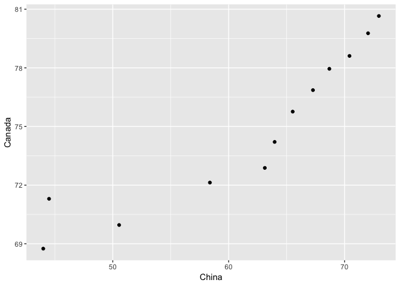
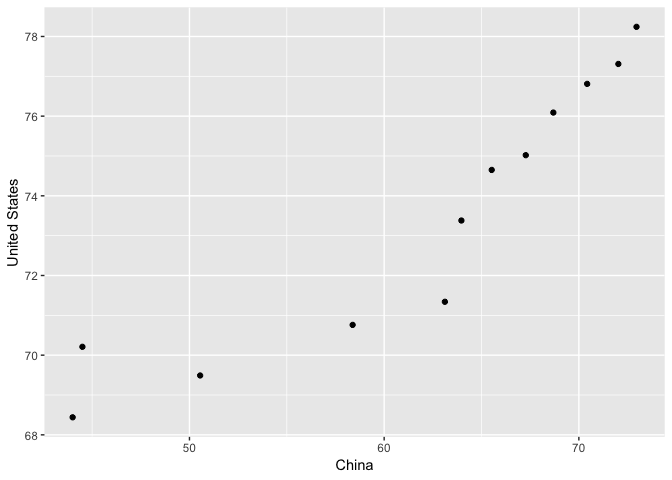
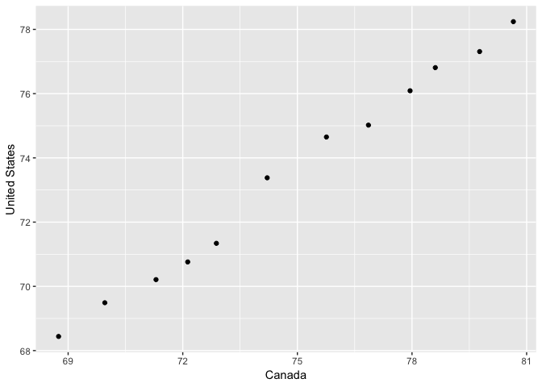

hw04 Tidy data and joins
================

``` r
suppressPackageStartupMessages(library(tidyverse))
suppressPackageStartupMessages(library(gapminder))
```

``` r
library(tidyverse)
library(knitr)
library(gapminder)
```

### Data Reshaping Prompts (and relationship to aggregation)

#### Activity \# 2

Make a tibble with one row per year and columns for life expectancy for two or more countries. Use knitr::kable() to make this table look pretty in your rendered homework. Take advantage of this new data shape to scatterplot life expectancy for one country against that of another.

For this task, I will take the life expectancy of Canada, China, and United States. In order to create the desired table for task, we need reshape the tibble to put each of the country into a column. This can be accomplished by the `spread()` function, which will make the chosen keys (country) into columns and put the values (life expectancy) into the rows.

``` r
spreadLifeExp <- gapminder %>% 
  filter(country == "Canada" | country == "China" | country == "United States") %>% 
  select(country, year, lifeExp) %>% 
  spread(key=country, value=lifeExp) 

spreadLifeExp %>% 
    knitr::kable()
```

|  year|  Canada|     China|  United States|
|-----:|-------:|---------:|--------------:|
|  1952|  68.750|  44.00000|         68.440|
|  1957|  69.960|  50.54896|         69.490|
|  1962|  71.300|  44.50136|         70.210|
|  1967|  72.130|  58.38112|         70.760|
|  1972|  72.880|  63.11888|         71.340|
|  1977|  74.210|  63.96736|         73.380|
|  1982|  75.760|  65.52500|         74.650|
|  1987|  76.860|  67.27400|         75.020|
|  1992|  77.950|  68.69000|         76.090|
|  1997|  78.610|  70.42600|         76.810|
|  2002|  79.770|  72.02800|         77.310|
|  2007|  80.653|  72.96100|         78.242|

Then, we can plot the life expentacy for `China vs Canada`, `China vs United States`, and `Canada vs United States`.

``` r
spreadLifeExp %>% 
  ggplot(aes(x = China, y = Canada)) + 
  geom_point()
```



``` r
spreadLifeExp %>% 
ggplot(aes(x = China, y = `United States`)) + 
    geom_point()
```



``` r
spreadLifeExp %>% 
ggplot(aes(x = Canada, y = `United States`)) + 
    geom_point()
```



### Join Prompts (join, merge, look up)

#### Activity \# 1

Create a second data frame, complementary to Gapminder. Join this with (part of) Gapminder using a dplyr join function and make some observations about the process and result. Explore the different types of joins. Examples of a second data frame you could build: One row per country, a country variable and one or more variables with extra info, such as language spoken, NATO membership, national animal, or capitol city. One row per continent, a continent variable and one or more variables with extra info, such as northern versus southern hemisphere.
